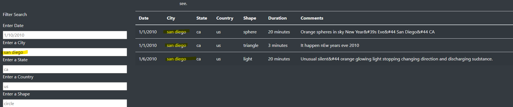

# UFOs :space_invader:
### Module 11 JavaScript Challenge

## Overview of Project
Dana's webpage has been done, but she wants me to help put more filters at the same time for a user-friendly webpage!

## Results: 
- Dana's webpage looks like this after revising her codes :

  - We have now 5 different criteria 
    - Date, City, State, Country, and Shape -> Now users can type in! 

  - Now we input "san diego" in the "city" filter and we see the filtered data. How convenient!
 
## Summary: 
#### Think webpages should be user-friendly! 
I helped her make this webpage to have more criteria, but I thought it wasn't quiet user friendly, because :
  1. If I can not find any result after typing in, then I have to go back and delete each input myself.
      - We might want to make a filter button, so if the webpage couldn't find anything with my filter input, it could reset my old input.  
  2. Let's say I entered into the first filter which is "date" and if I don't move my mouse cursor, then the result doesn't update
      - We might want to do something about that, such as putting a button for each filter and one at the very bottom (for all filters).
