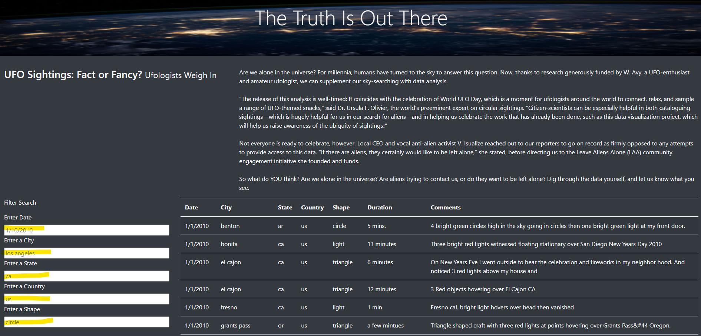

# UFOs :space_invader:
### Module 11 JavaScript Challenge! 

## Overview of Project
Dana's webpage has been done, but she wants to put more filters at the same time for the users, so they are able to have more in-dept analysis. 

## Results: 
- Dana's webpage looks like this:

  - We have now 5 different criteria 
    - Date, City, State, Country, and Shape -> Now users can type in! 
 

Describe to Dana how someone might use the new webpage by walking her through the process of using the search criteria. Use images of your webpage during the filtering process to support your explanation.

## Summary: 
In a summary statement, describe one drawback of this new design and two recommendations for further development.
